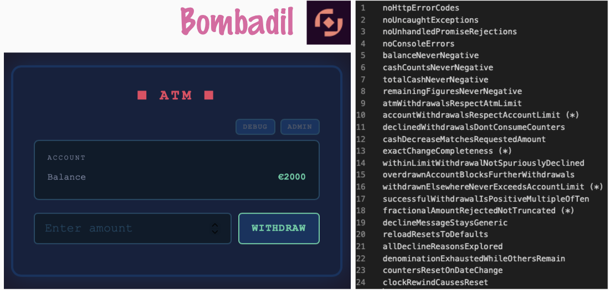

# Property-based testing a web UI with Bombadil



One flow, start to finish: what the tool is, what a property is, and five short demos on an ATM app I was fixing this week. Each demo shows the prompt that built it and the command that runs it.

## 1. New tool in the house: Bombadil

[Bombadil](https://antithesishq.github.io/bombadil/index.html) is property-based testing for web UIs. Instead of scripting test cases, you state what must always be true, and the tool explores the app on its own: it clicks, types, scrolls and reloads, and checks every property in every state it reaches.

It runs in a loop:

1. Extract the current state from the browser.
2. Check all properties against that state.
3. Pick the next action and perform it.
4. Wait for the page to settle, then start over.

## 2. What is a _property_, and how do testers reason about them

A property is a statement about the system that should hold in general, not for one example.

- Example-based: "withdraw €50 from €2000, balance shows €1950."
- Property: "the balance is never negative", "a declined withdrawal changes nothing", "the account never withdraws more than its daily limit".

Three things are worth keeping apart:

- **Authoring** — always AI!
- **Execution** — generated vs. handcrafted.
- **Oracles** — always-true statements vs. specific checks.

Note: authoring with AI, but not running agentic testing. These are deterministic generated tests. Fewer tokens harmed by knowing the difference.

Note: this _manual automation_ demo belongs in a frame of true automation with pipelines.

## 3. The app under test: before and after this week's fixes

The ATM simulator is a single HTML page: balance, amount field, WITHDRAW, plus DEBUG and ADMIN panels for limits, cash and clock. I fixed bugs in it on Tuesday, so there are two versions side by side:

- `Monday/` — before the fixes.
- `Thursday/` — today's version.

```text
I have a project here called atm that I was fixing on Tuesday this week. I want a Monday's version of
that html app brought to this project, into folder Monday. And today's version of that html app
brought to this project, into folder Thursday. Would you be able to do that for me?
```

## 4. Demo: default properties

Bombadil ships with four properties that fit any web app:

- no HTTP error codes,
- no uncaught exceptions,
- no unhandled promise rejections,
- no console errors.

```text
Use playwright-cli to look at Monday and Thursday apps, and build basic property-based testing with
default properties for each, into folders Monday-test and Thursday-test. I want to use Bombadil for
property-based testing https://antithesishq.github.io/bombadil/index.html

I want to be able to run Monday-test saying 'demo Monday' and Thursday-test by saying 'demo Thursday'
on command line. Make my wish come true, like magic!
```

```
demo Monday
demo Thursday
```

Both run for a minute and both pass. That is the point of this step: the Monday version has real bugs, and the default properties do not see them. They catch crashes, not broken ATM rules.

New tool, so: the default typing action entered the letter "d" into number fields instead of digits, and runs sometimes stalled. The specs in `Monday-test` and `Thursday-test` work around both.

## 5. Demo: state extractors, generators, properties and helpers

To test the rules of the ATM, the specification needs to know the domain. `Full-test/bombadil/specification.ts` has four kinds of building blocks:

- **Helpers** — turn rendered text like "€1950" into numbers.
- **State extractors** — read balance, limits, bill counts and transaction history from the page in every state.
- **Properties** — the always-true statements, written over those extractors.
- **Action generators** — put real, boundary-hitting numbers into the fields (zero, one over the limit, fractional, negative), so the interesting rules are actually reached.

## 6. Demo: more properties

20 more properties on top of the four defaults, produced by running the antithesis research skill on the app's source code. The list is in `Full-test/properties.txt`, the reasoning behind each in `Full-test/scratchbook/`.

```text
There's also project here called exploring-bombadil, with full set of tests. Bring those here under Full-test
folder. Now, I want to say 'magic Monday' to run this test for 60 seconds on Monday version, and 'magic Thursday' on the Monday version.
```

```
magic Monday
magic Thursday
```

- **`magic Monday`** stops within a second or two. Typing more into "Withdrawn at other ATMs" than the account's daily limit allows violates `accountWithdrawalsRespectAccountLimit` and `withdrawnElsewhereNeverExceedsAccountLimit`.
- **`magic Thursday`** runs the full 60 seconds with no violations.

To look at what happened, state by state:

```
cd Full-test
npm run inspect:monday
```

## 7. Demo: properties on Playwright

Properties mix with old tools too! The same property names, checked by one Playwright test that takes a seeded random walk through the app and checks the properties after every step.

```text
Just for the show of it, create me one playwright tests that uses the properties like I specified for Full-test.
Let me run it with 'magic playwright Monday' or 'magic playwright Tuesday'. Run it headful. Make it use webkit as browser.
```

```
magic playwright Monday
magic playwright Thursday
```

- **Monday** fails after five steps on `accountWithdrawalsRespectAccountLimit` — the same bug Bombadil finds.
- **Thursday** passes all 300 steps.

The test covers 13 of the properties (the state invariants and the withdrawal step properties), runs in WebKit with a visible window, and replays the same walk for the same seed.

## 8. Driver protocols

Should we talk driver protocols: CDP in Bombadil vs. CDP in Playwright vs. WebDriver BiDi? That all matters more now with AI.

## 9. Beyond the ATM

New tool, so I also tested Prestashop and D365FO with it.

Next practice:

- PR to fix the tool so that it works with D365 FO.
- Report / fix the three problems + the hundreds of API problems this found on Prestashop, for common good?

# What I would also want to show you...

- Local LLM use for notetaking and summarizing
- 2nd brain aka. LLM Wiki, and how that is different from RAG. Maybe go Caveman?
